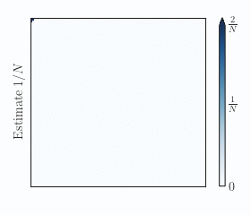
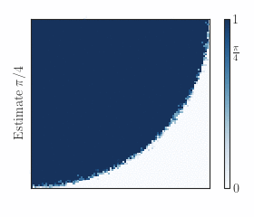
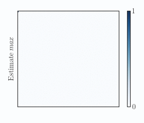

# Building Dynamic Overlays by Epidemic Protocols #

Final project of the Peer to Peer and BlockChain course (P2PBC) at University of Pisa.

The request of the project was to simulate the Newscast protocol with the goal of evaluating some characteristics of the topology generated from the application of the protocol.

## Some examples ##

### Estimate the size of the network ###
In the first example, at cycle 0 a single node stores 1 as internal value, while all other nodes store 0. As the aggregation protocol runs, the stored values of every node converge to 1/*N*, where *N* is the size of the network. After 53 cycles, every node have the value stored correctly with an accuracy of 1%.

  

### Estimate π ###

This task has no real life application, and was set up as a toy example: before the first protocol cycle, every node of the grid stores 1 if the 2-norm of node position is less than the grid side  (i.e. ‖(*x*,*y*)‖ ≤ *S*, where *S* is the side of the grid), otherwise stores 0. As the aggregation protocol runs, the stored values of every node converge to π/4. After 51 cycles, every node have the value stored correctly with an accuracy of 1%.

  

### Estimate *max* ###

The last example is a simple task of epidemic-based aggregation: every node adopts *max*(·,·) as aggregation function and, as in the first example, the network starts with all agents' values to 0 but 1. The convergence is much faster: after 21 cycles every node knows the maximum value in the network. This example can be seen as an alarm propagation: we could substitute the aggregation function with a boolean *OR*, which would set the stored value to *true* (i.e, the alarm goes on) if one of the aggregated pair is *true*. The propagation rate would be analogous to the one reported in this example. 

  

## References ##

[1] M.Jelasity, W.Kowalszyk, M.van Steen Newscast Computing, Internal Report IR-CS-006 VUA, Amsterdam, 2003
